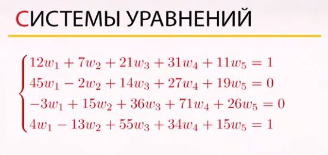
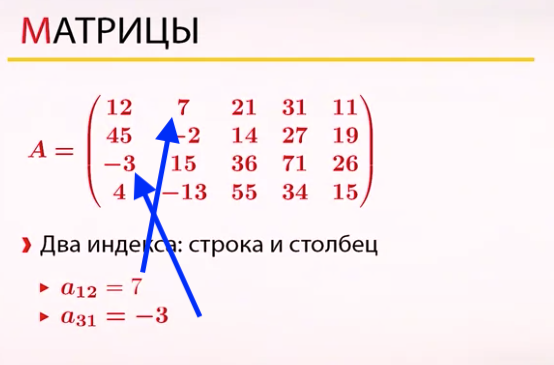
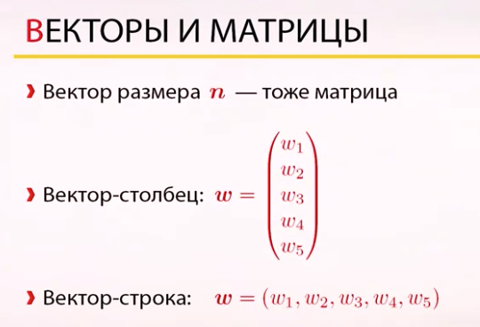
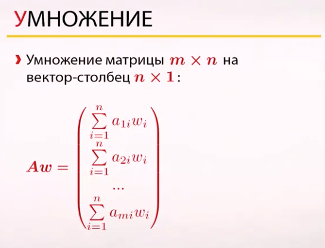
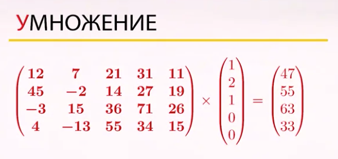
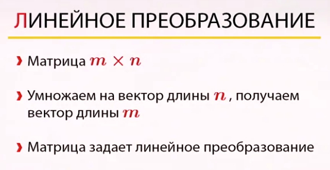

### Системы уравнений

### Матрицы

### Векторы и матрицы
Вектор также можно представить матрицей, только вырожденной - столбцом либо строчкой
 

### Умножение

### Умножение матрицы на вектор

### Линейное преобразование
