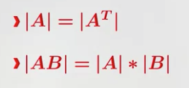

## Определитель

### Два вектора

### Свойства определителя
 - только для квадратной матрицы
- много способов задать
- объем параелограмма из n - векторов
- можно определять рекурсивно - теорема Гаусса

### Линейно зависимые вектора

- определитель равен нуля тогда и только тогда, когда строки матрицы линейно зависимы
- то же самое про столбцы

###  Еще свойства

## Ранг матрицы
- Ранг системы строк матрицы А - максимальное число линейно независимых строк среди них
- Ранг системы столбцов матрицы А - максимальное число линейно независимых столбцов среди них
- Важный результат: ранг по столбцам и по строкам всегда совпадают
- Обозначение rg A

