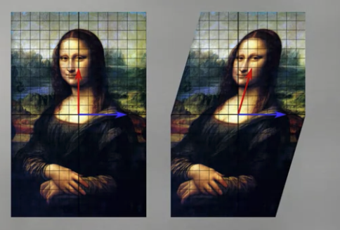
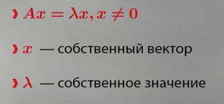

## Собственные векторы

Собственный вектор - тот который не меняет своего направления при линейном преобразовании.
Он смотрит в ту сторону в которую происходит линейная трансформация.
Собственные векторы - направления, в которых матрица лишь растягивает или сжимает векторы, но не поворачивает

